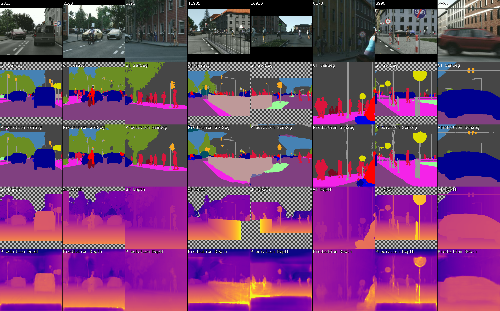

# CVAIAC Exercise 1 

Dense prediction Dense Predictions from Single Image: Semantic Segmentation and Depth Estimation


 
This is a template project for the practical assignment #1 in Computer Vision and Artificial Intelligence for Autonomous Cars course:
https://www.trace.ethz.ch/teaching/CVAIAC2023/index.html

Please refer to the assignment PDF for instructions regarding the assignment scope. 


### Environment Setup

If not already done, please follow the [First Tutorial](https://www.trace.ethz.ch/teaching/CVAIAC2023/exercises/Exercise_01-intro_to_slurm_ac_course.pdf) to setup your environment.
To setup the specific environemnt for this exercise you should run (from the root of the project folder and in an interactive session with a GPU):
```shell script
conda activate py39
PIP_CACHE_DIR=/srv/beegfs-benderdata/scratch/$USER pip install -r requirements.txt
```

### Interactive Debugging

You can launch an interactive session with:

```shell script
srun --nodes=1 --time=8:00:00 --ntasks=1 --ntasks-per-node=1 --cpus-per-task=4 --mem-per-cpu=4G --gpus-per-node=1 --pty bash -i
```

To keep it alive you can use tmux before launching the interactive session. If you want to close the connection
but keep the script running, detach from tmux using Ctrl+B and D. After that, you can exit the ssh connection, while
tmux and the training keep running. You can enter the scroll mode using Ctrl+B and [ and exit it with Q. 
In the scroll mode, you can scroll using the arrow keys or page up and down. Tmux has also some other nice features
such as multiple windows or panels (https://www.hamvocke.com/blog/a-quick-and-easy-guide-to-tmux/). Please note
that there is a **timeout** of 24 hours to the instance. If you find that not sufficient, please adjust 
`TIMEOUT = 24  # in hours`

Finally to launch a training from an interactive job you can use the bash script [shell_train.sh](shell_train.sh). Here is also the place, where you want to specify your hyperparameters as command line arguments. The default call looks like this:

```shell script
python -m source.scripts.train \
  --log_dir ${SAVEDIR} \
  --dataset_root ${TMPDIR}/miniscapes \
  --name sbatch_multi \
  --model_name deeplabv3p \
  --optimizer adam \
  --tasks semseg \
  --optimizer_lr 0.0001 \
  --batch_size 16 \
  --num_epochs 10 \
  --workers ${SLURM_CPUS_PER_TASK} \
  --workers_validation ${SLURM_CPUS_PER_TASK} \
  --batch_size_validation 16 \
  --optimizer_float_16 no
```

You should modify the flags as you prefer, for instance the tasks are semseg and depth, you can combine them to have a multitask training (if possible). 
You should modify the variable TEAM_ID to your specific team id.
The full description of all command line keys can be found in [config.py](source/utils/config.py). You can have a look at [train.py](source/scripts/train.py) to modify logging and debugging.


### Sbatch Training

In order to submit a job, you can use the bash script [slurm_train.sh](slurm_train.sh). The structure is the same as the interactive version. The `#SBATCH` command at the top of the script are the instruction for SLURM aboout tresources allocation and requirements.


### Monitoring

You can monitor the training via the wandb web interface https://wandb.ai/home.
In the workspace panel, we recommend switching the x-axis to epoch (x icon in the top right corner) for
visualization.
The logged histograms, you can only view if you click on a single run.

In order to properly use wandb, you have to copy your key under wandb.key and follow the instructions in the handout.


### Checkpoints and Submission

Checkpoints and submission files are saved under `$SAVEDIR` defined in the bash script. 
It is important to remember that the folder is cleaned at every start of any training. Therefore, if you want to preserve a checkpoint or a submission file you should either move or copy to another location than `$SAVEDIR`.
The Submission Zip is the one required for CodaLab.


### Resume Training

If a training was not finished or you want to train for more eopchs, you can resume a training by providing the resume flag to source.scripts.train.

```shell script
  --resume <PATH-TO-CHECKPOINT>
```
